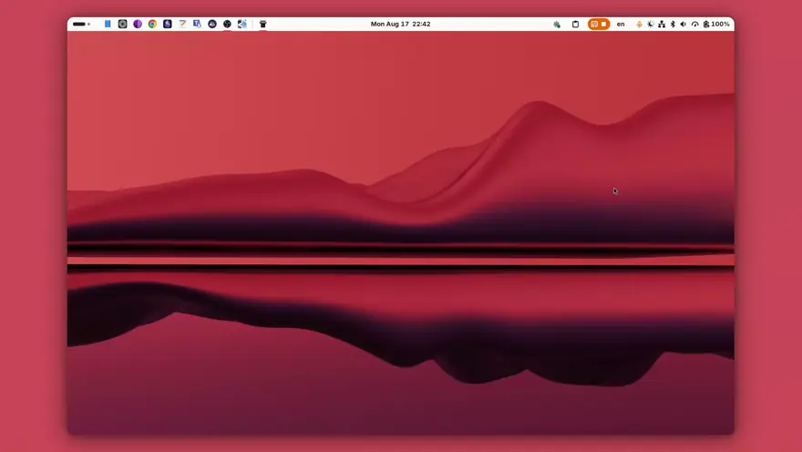
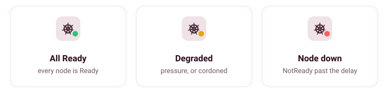
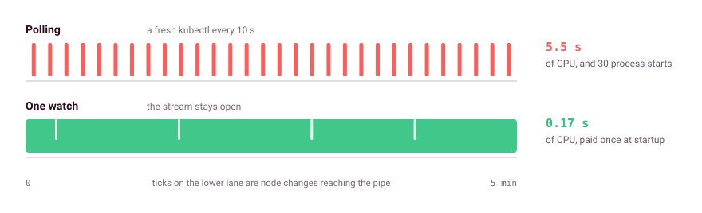
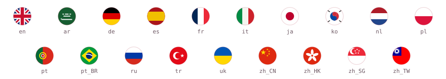

<!--
  Brand art in docs/images/brand/ is generated, not hand-edited.
  Each <picture> carries a dark and a light file; GitHub picks one by theme.
-->

<p align="center">
  <picture>
    <source media="(prefers-color-scheme: dark)" srcset="docs/images/brand/hero-dark.svg">
    <source media="(prefers-color-scheme: light)" srcset="docs/images/brand/hero-light.svg">
    
  </picture>
</p>

<p align="center">
  <a href="https://github.com/cerobreath/gnome-kube-monitor/actions/workflows/ci.yml"></a>
  <a href="https://github.com/cerobreath/gnome-kube-monitor/releases/latest"></a>
  
  
  <a href="LICENSE"></a>
</p>

<!--
  PUBLISH TODO: uncomment once the extension is live on extensions.gnome.org and
  the numeric <ID> is known.

  <p align="center">
    <a href="https://extensions.gnome.org/extension/<ID>/kube-node-monitor/">
      
    </a>
  </p>
-->

A GNOME Shell extension that puts Kubernetes node health in the top bar. A dot stays green while every node is Ready, amber when one degrades, red when one drops out. A node going down is something you see, not something you find out later. Open the menu for the detail; the rest of the time it says nothing.

It runs on the `kubectl` and kubeconfig you already have, so whatever context and auth work in your terminal work here. It never writes to your cluster.

<p align="center">
  <picture>
    <source media="(prefers-color-scheme: dark)" srcset="docs/images/brand/demo-dark.webp">
    <source media="(prefers-color-scheme: light)" srcset="docs/images/brand/demo-light.webp">
    
  </picture>
</p>

<!-- MEDIA: full walkthrough
  The long cut lives on GitHub's CDN, not in the repo: drag the .mp4 into any issue
  on this repo and paste the resulting user-attachments URL below.

  <p align="center">
    <a href="https://github.com/user-attachments/assets/…"><b>Watch the full walkthrough</b></a>
  </p>
-->

## Install

Needs GNOME Shell 45 to 50, `kubectl` on your `PATH`, and a working kubeconfig. Per-node CPU and memory bars need metrics-server in the cluster; nothing else depends on it.

Not on [extensions.gnome.org](https://extensions.gnome.org) yet, so install from source:

```bash
git clone https://github.com/cerobreath/gnome-kube-monitor.git
cd gnome-kube-monitor
./install.sh
gnome-extensions enable kube-monitor@cerobreath.dev
```

`install.sh` compiles the GSettings schema and symlinks the folder into `~/.local/share/gnome-shell/extensions`. On Wayland you have to log out and back in before the shell will pick up a new extension.

<details>
<summary>From a zip, or uninstalling</summary>

```bash
npm run pack   # builds kube-monitor@cerobreath.dev.shell-extension.zip
gnome-extensions install --force kube-monitor@cerobreath.dev.shell-extension.zip
```

Every tagged release attaches that same zip, built from source by CI.

```bash
gnome-extensions disable kube-monitor@cerobreath.dev
rm ~/.local/share/gnome-shell/extensions/kube-monitor@cerobreath.dev
dconf reset -f /org/gnome/shell/extensions/kube-monitor/
```

</details>

## What you get

The Kubernetes helm sits in the panel with a status dot in the corner, tracking the worst node in the cluster.

<p align="center">
  <picture>
    <source media="(prefers-color-scheme: dark)" srcset="docs/images/brand/panel-states-dark.svg">
    <source media="(prefers-color-scheme: light)" srcset="docs/images/brand/panel-states-light.svg">
    
  </picture>
</p>

Open it and you get the current context, how stale the data is, a pods line (running, pending, crash-looping, failed), and your nodes worst-first: each with its state, how long it has been up or down, its role or the reason it is unhappy, and CPU/memory bars where metrics-server provides them. Plus a context switcher, a mute submenu, and settings.

Outside the menu it does two things. It posts a desktop notification when a node stays NotReady, when the cluster stops answering, and again on recovery, withdrawing the outage banner that the recovery answers so the tray never fills up with resolved alarms. And clicking a node copies `kubectl describe node <name>` to your clipboard.

## Settings

<p align="center">
  <picture>
    <source media="(prefers-color-scheme: dark)" srcset="docs/images/brand/prefs-dark.svg">
    <source media="(prefers-color-scheme: light)" srcset="docs/images/brand/prefs-light.svg">
    
  </picture>
</p>

Leave context, kubeconfig and kubectl empty and it finds your current context, `~/.kube/config` (or `$KUBECONFIG`), and `kubectl` on your `PATH`. A green check marks each one it resolves, and **Test** lists the contexts it can see. The rest is the refresh interval and the notification timings: how long something must stay broken before you hear about it, how long an alert is held after it clears so a flapping node only notifies once, how often to repeat, and how long to batch simultaneous alerts into one banner.

> [!NOTE]
> If your kubeconfig authenticates through SSO/OIDC (an exec plugin such as kubelogin), background polling will not pop a browser window at you. Log in once in a terminal and the extension reuses that token. When it expires the menu says so and polls fail quietly until you sign in again.

## How it works

All of this runs inside the compositor process, so a slow call is a stuttering desktop. The answer is to spend almost nothing while the menu is closed, which is nearly always.

<p align="center">
  <picture>
    <source media="(prefers-color-scheme: dark)" srcset="docs/images/brand/watch-dark.svg">
    <source media="(prefers-color-scheme: light)" srcset="docs/images/brand/watch-light.svg">
    
  </picture>
</p>

It used to poll. Every ten seconds a fresh `kubectl` started, asked for every node, printed a few hundred bytes and exited. The small output made it look cheap, but the output was never the cost. Starting `kubectl` at all is 56 MB of memory and 90 ms of CPU before it has spoken to anything, and the request pulls the full node objects, about 27 KB per node on a real cluster. Over an hour that is 360 processes and 66 seconds of CPU.

Now one `kubectl get nodes --watch` stays open. The API server sends the list once, then only what changed. A node dropping reaches the extension in under a tenth of a second instead of waiting out an interval, and the stream costs 170 ms of CPU once and then holds flat at 62 MB.

Polling did not go away, it became the fallback. It carries the load until the watch delivers its first snapshot, and any trouble with the stream brings it straight back, so every failure path is the one that was already there: backoff on an unreachable cluster, a watchdog that kills a hung `kubectl`, and no outage alert when it is your laptop that is offline rather than the cluster.

Opening the menu is the expensive tier, and it is the one you asked for: full node detail at roughly 36 KB per node, capped at 50 rows sorted worst-first. Without that cap a 1000-node cluster freezes the shell for nearly two seconds on every open.

Details on the module layering, the alert state machine and the measurements behind all of this: [`docs/architecture.md`](docs/architecture.md). Threat model and trust boundaries: [`SECURITY.md`](SECURITY.md).

## Translations

<p align="center">
  <picture>
    <source media="(prefers-color-scheme: dark)" srcset="docs/images/brand/languages-dark.svg">
    <source media="(prefers-color-scheme: light)" srcset="docs/images/brand/languages-light.svg">
    
  </picture>
</p>

Eighteen catalogues covering fourteen languages, plus the English source. It follows your desktop's language with nothing to configure. Regional variants fall back to the base language, so `de_AT` and `fr_CA` are covered by `de` and `fr`. Chinese and Portuguese get a catalogue per region because gettext falls back *down* to the bare language but never *sideways*: without `zh_HK` of its own, a Hong Kong desktop would land on English rather than on `zh_TW`.

Kubernetes' own vocabulary stays in English on purpose. `Ready`, `NotReady`, `SchedulingDisabled`, the pressure conditions and node roles are what `kubectl get nodes` prints, and translating them would make the menu disagree with the command it is a window onto.

> [!IMPORTANT]
> English is the source text and is written by hand, as are `ru` and `uk`, which the maintainer reads. The other sixteen catalogues were machine-generated and then checked language by language against their GNOME translation team's conventions. That is review, not native sign-off. Corrections are very welcome and the `Last-Translator` field is yours to claim. See [`docs/translations.md`](docs/translations.md).

## Roadmap

<p align="center">
  <picture>
    <source media="(prefers-color-scheme: dark)" srcset="docs/images/brand/roadmap-dark.svg">
    <source media="(prefers-color-scheme: light)" srcset="docs/images/brand/roadmap-light.svg">
    
  </picture>
</p>

The parts that do the thinking, parsing, severity, sorting, scheduling, alerting and formatting, have no `gi://` imports at all. About 40% of the shipped JavaScript. They already run unchanged under Node, plain GJS and gnome-shell, which is what the whole test suite depends on. The rule started life as a testability constraint. It turns out to be a portability one too.

So the plan is to keep that core and rewrite only the edges: KDE Plasma first as a Plasmoid, then a Windows tray app and a macOS menu bar app, each replacing the same three files. No dates on any of it. GNOME Shell stays the reference implementation and gets fixes first.

If you want a particular platform, an issue saying so is the most useful vote there is. If you would rather not wait, fork it. The core is the part worth taking, it is licensed to be taken, and a working port is more convincing than a roadmap entry.

## Development

Tooling needs Node 24 or newer; the extension itself runs on GJS and never touches Node. There is no build step, and TypeScript only type-checks through JSDoc.

```bash
npm install        # dev tooling only: eslint, typescript, @girs types. Never shipped.
npm test           # unit tests
npm run check      # THE GATE: lint + typecheck x2 + 100% coverage + i18n
npm run pack       # -> kube-monitor@cerobreath.dev.shell-extension.zip
```

`npm run check` is what the pre-commit hook and CI both run. Coverage is enforced at 100% by threshold rather than by convention, so a drop fails the build. Conventions a change is expected to follow are in [`AGENTS.md`](AGENTS.md).

Bug reports and pull requests are welcome. For a bug, the extension version, your GNOME Shell version and your `kubectl` version cover most of what is needed to reproduce it.

## License

Distributed under the terms of the [GNU General Public License, version 2 or later](LICENSE). © 2026 Denys Lysenok.
