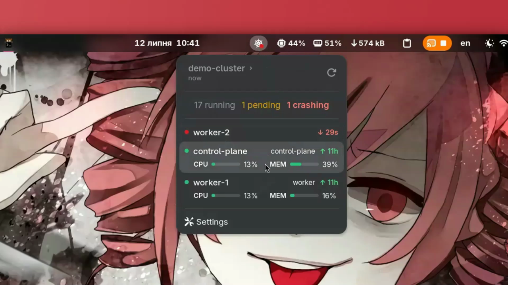
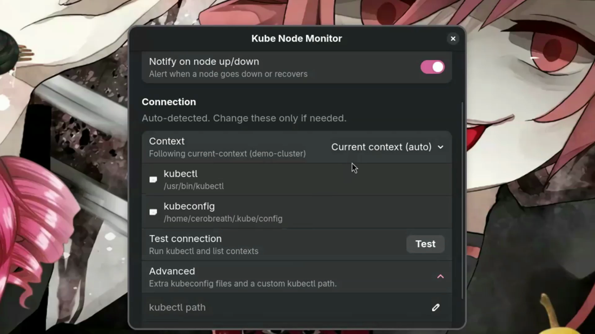

<!--
  Brand art lives in docs/images/brand/ and is generated, not hand-edited.
  Screenshots and video go in docs/images/. Each <picture> carries a dark and a
  light file; GitHub picks one from the reader's theme.
-->

<p align="center">
  <picture>
    <source media="(prefers-color-scheme: dark)" srcset="docs/images/brand/hero-dark.svg">
    <source media="(prefers-color-scheme: light)" srcset="docs/images/brand/hero-light.svg">
    
  </picture>
</p>

<p align="center">
  <a href="https://github.com/cerobreath/gnome-kube-monitor/actions/workflows/ci.yml"></a>
  <a href="https://github.com/cerobreath/gnome-kube-monitor/releases/latest"></a>
  
  
  <a href="LICENSE"></a>
</p>

<!--
  PUBLISH TODO: uncomment once the extension is live on extensions.gnome.org and
  the numeric <ID> is known.

  <p align="center">
    <a href="https://extensions.gnome.org/extension/<ID>/kube-node-monitor/">
      
    </a>
  </p>
-->

You already run `kubectl get nodes` a dozen times a day to check that nothing is on fire. This puts the answer in the top bar instead. A dot stays green while every node is Ready, turns amber when one degrades, and goes red when one drops out. Open the menu when you want the detail. The rest of the time it says nothing.

It runs on the `kubectl` and kubeconfig you already have, so whatever context and auth work in your terminal work here. It never writes to your cluster.

<!-- MEDIA: demo  (replaces the 0.1.0 recording)
  What: ~30s walkthrough at 1.0.0. Open the menu, node meters, click-to-copy,
        context switcher, preferences.
  How to embed: drag the .mp4 into any issue or PR comment on this repo, then
        paste the resulting user-attachments URL below. GitHub only plays <video>
        from its own hosts, so a committed path will not autoplay inline.

  <p align="center">
    <video src="https://github.com/user-attachments/assets/…" controls muted width="880"></video>
  </p>
-->

<p align="center">
  
</p>

## Requirements

| | |
| --- | --- |
| GNOME Shell | 45 through 50 |
| `kubectl` | any version on your `PATH`, or an explicit path in settings |
| kubeconfig | `~/.kube/config`, `$KUBECONFIG`, or an explicit path |
| metrics-server | optional. Without it you lose the per-node CPU and memory bars, nothing else |

## Install

Not on [extensions.gnome.org](https://extensions.gnome.org) yet, so install from source:

```bash
git clone https://github.com/cerobreath/gnome-kube-monitor.git
cd gnome-kube-monitor
./install.sh
gnome-extensions enable kube-monitor@cerobreath.dev
```

`install.sh` compiles the GSettings schema and symlinks the folder into `~/.local/share/gnome-shell/extensions`. On Wayland you have to log out and back in before the shell will pick up a new extension.

<details>
<summary>Installing from a zip instead</summary>

```bash
npm run pack   # builds kube-monitor@cerobreath.dev.shell-extension.zip
gnome-extensions install --force kube-monitor@cerobreath.dev.shell-extension.zip
```

Every tagged release also attaches that zip, built from source by CI.

</details>

<details>
<summary>Uninstalling</summary>

```bash
gnome-extensions disable kube-monitor@cerobreath.dev
rm ~/.local/share/gnome-shell/extensions/kube-monitor@cerobreath.dev
dconf reset -f /org/gnome/shell/extensions/kube-monitor/
```

</details>

## What you get

### On the panel

The Kubernetes helm with a status dot in the corner, tracking the worst node in the cluster. The dot follows your panel's light or dark theme.

<p align="center">
  <picture>
    <source media="(prefers-color-scheme: dark)" srcset="docs/images/brand/panel-states-dark.svg">
    <source media="(prefers-color-scheme: light)" srcset="docs/images/brand/panel-states-light.svg">
    
  </picture>
</p>

### In the menu

- the current context, a refresh button, and how stale the data is: `now`, `45s`, `3m`;
- a pods line: running, pending, crash-looping, failed;
- your nodes, worst first, each with a dot, a name, how long it has been up or down, its role or the reason it is unhappy, and CPU/memory bars when metrics-server is around;
- a context switcher, a **Mute alerts** submenu (15 minutes, 1 hour, 8 hours), and **Settings**.

Two things that happen outside the menu:

- **Notifications** when a node stays NotReady, when the whole cluster stops answering, and again on recovery. A recovery withdraws the outage banner it answers, so the tray never fills up with alarms that already resolved.
- **Click a node** to copy `kubectl describe node <name>` to the clipboard.

<!-- MEDIA: notification
  What: the "worker-2 is down" banner, ideally with the red panel dot in frame.
        Reproduce with: docker stop k3d-demo-agent-1
  Drop at: docs/images/notification.png, then uncomment.

  <p align="center">
    
  </p>
-->

## Settings

```bash
gnome-extensions prefs kube-monitor@cerobreath.dev
```

<p align="center">
  
</p>

**Connection.** Leave context, kubeconfig and kubectl empty and it finds your current context, `~/.kube/config` (or `$KUBECONFIG`), and `kubectl` on your `PATH`. A green check appears next to each one it resolves, and **Test** lists the contexts it can see.

**Refresh interval**, in seconds.

**Notifications.** Three switches, for node problems, an unreachable cluster, and recovery. Under them are the timings: how long something has to stay broken before you hear about it, how long an alert is held after it clears so a flapping node only notifies once, how often to repeat, and how long to batch simultaneous alerts into a single banner.

> [!NOTE]
> If your kubeconfig authenticates through SSO/OIDC (an exec plugin such as kubelogin), background polling will not pop a browser window at you. Log in once in a terminal and the extension reuses that token. When it expires the menu says so and polls fail quietly until you sign in again.

## How it works

Polling happens inside the compositor process, which means a slow poll is a stuttering desktop. So there are two tiers, chosen by whether the menu is open.

<p align="center">
  <picture>
    <source media="(prefers-color-scheme: dark)" srcset="docs/images/brand/polling-dark.svg">
    <source media="(prefers-color-scheme: light)" srcset="docs/images/brand/polling-light.svg">
    
  </picture>
</p>

With the menu closed, which is nearly always, one compact jsonpath query returns about 251 bytes for the whole cluster. That is the entire steady-state cost, and it drives the panel dot and the notifications. Opening the menu switches to full node detail, per-node metrics and the pods summary: roughly 36 KB per node, measured on a real cluster rather than guessed at. Rows update in place instead of being rebuilt, and the list is capped at 50, sorted most-severe-first, which holds menu-open cost flat however large the cluster gets. Without that cap a 1000-node cluster freezes the shell for nearly two seconds on every open. The profiling behind the number is in [`docs/architecture.md`](docs/architecture.md).

When the cluster stops answering, it backs off instead of hammering the network: 10 seconds, then longer, capped at a minute. Every poll arms a watchdog that kills a hung `kubectl`, so an unreachable cluster cannot wedge the menu on "Loading".

It also tells the difference between your cluster being down and your laptop being off the network. With no route there is no "cluster unreachable" alert, just a quiet note in the menu, and the moment the connection is back it re-polls immediately instead of sitting out the backoff. A cluster on localhost keeps being watched either way.

Alerting is a small state machine modelled on Prometheus rules: a `for` debounce before firing, a hold after clearing so a flapping node notifies once, and a batch window that coalesces simultaneous alerts into one banner. It survives a reboot, a suspend and a long screen lock without inventing alerts about the gap.

## Security

Read-only by construction, and the details are worth knowing before you point it at a production cluster.

- It runs `kubectl get` and `kubectl config`, never anything that mutates. It holds no credentials of its own.
- `kubectl` is spawned through an argv array, never a shell, with `--request-timeout=5s` and a local watchdog.
- The child process gets an **allowlisted environment**, not your session's. `kubectl` hands its environment to exec credential plugins, so the SSH agent socket, bus address and keyring control are deliberately withheld, and `BROWSER` is neutralised so a background poll cannot open a login window.
- Credential-shaped text is stripped before anything reaches the menu, and notification bodies carry no `kubectl` output at all, because GNOME shows notification bodies on the lock screen.
- Nothing is logged unless you turn on diagnostics, and even then every line is redacted.

Full threat model, trust boundaries and reporting process: [`SECURITY.md`](SECURITY.md).

## Translations

<p align="center">
  <picture>
    <source media="(prefers-color-scheme: dark)" srcset="docs/images/brand/languages-dark.svg">
    <source media="(prefers-color-scheme: light)" srcset="docs/images/brand/languages-light.svg">
    
  </picture>
</p>

Eighteen catalogues covering fourteen languages, plus the English source. It follows your desktop's language and there is nothing to configure.

Regional variants fall back to the base language, so `de_AT`, `fr_CA`, `es_MX` and `nl_BE` are covered by `de`, `fr`, `es` and `nl`. Chinese and Portuguese get a catalogue per region because gettext falls back *down* to the bare language but never *sideways*: without `zh_HK` of its own, a Hong Kong desktop would land on English rather than on `zh_TW`.

Kubernetes' own vocabulary stays in English on purpose. `Ready`, `NotReady`, `SchedulingDisabled`, the pressure conditions and node roles are what `kubectl get nodes` prints, and translating them would make the menu disagree with the command it is a window onto.

> [!IMPORTANT]
> Every catalogue except `ru` and `uk`, which the maintainer reads, was machine-generated and then checked language by language against its GNOME translation team's conventions. That pass caught calques, register slips and two error headlines that had drifted from the source string. It is review, not native sign-off. Corrections are very welcome and the `Last-Translator` field is yours to claim.

<details>
<summary>Fixing or adding a language</summary>

```bash
npm run i18n:pot      # re-extract the template from the sources
npm run i18n:update   # merge it into every po/*.po
$EDITOR po/uk.po      # an empty msgstr or a #, fuzzy marker fails the build
npm run i18n:check    # completeness and format-string check
```

A new language also needs a line in `po/LINGUAS`. Coverage details and what has been verified at runtime are in [`docs/translations.md`](docs/translations.md).

</details>

## Roadmap

<p align="center">
  <picture>
    <source media="(prefers-color-scheme: dark)" srcset="docs/images/brand/roadmap-dark.svg">
    <source media="(prefers-color-scheme: light)" srcset="docs/images/brand/roadmap-light.svg">
    
  </picture>
</p>

The parts that do the thinking, parsing, severity, sorting, scheduling, alerting and formatting, have no `gi://` imports at all. About 40% of the shipped JavaScript. They already run unchanged under Node, plain GJS and gnome-shell, which is what the whole test suite depends on. The rule started life as a testability constraint. It turns out to be a portability one too.

So the plan is to keep that core and rewrite only the edges:

- **Other Linux shells.** KDE Plasma first, as a Plasmoid over the same core. Three files get replaced: the panel widget, the notification bridge, the preferences window.
- **Windows.** A tray app. Same poll loop, same alert state machine.
- **macOS.** A menu bar app, same deal.

No dates on any of it. GNOME Shell stays the reference implementation and gets fixes first. If you want a particular platform, an issue saying so is the most useful vote there is.

## Development

Tooling needs Node 24 or newer. The extension itself runs on GJS and never touches Node. There is no build step: gnome-shell loads the same `.js` files that are in the repo, and TypeScript only type-checks through JSDoc.

```bash
npm install        # dev tooling only: eslint, typescript, @girs types. Never shipped.
npm test           # unit tests
npm run check      # THE GATE: lint + typecheck x2 + 100% coverage + i18n
npm run pack       # -> kube-monitor@cerobreath.dev.shell-extension.zip
```

`npm run check` is what the pre-commit hook and CI both run. Coverage is enforced at 100% by threshold rather than by convention, so a drop fails the build.

<details>
<summary>Module layout</summary>

```
extension.js       enable/disable, wiring, alert dispatch
prefs.js           preferences window (libadwaita)

lib/model.js       parsers, severity, formatting, error classification
lib/alerts.js      alert state machine: debounce, dedup, grouping, silences
lib/schedule.js    poll-cadence math: interval clamp, backoff
lib/i18n.js        gettext wrappers and a %1$s formatter
lib/log.js         opt-in diagnostics, redacted
                   ^ the five above are pure: no gi:// imports, node-testable

lib/client.js      the only file that spawns kubectl
lib/poller.js      the poll loop: two-tier fetch, backoff, watchdog, reentrancy
lib/indicator.js   panel button and dropdown menu (St/Clutter)
lib/notifier.js    the extension's own MessageTray source

tests/             node --test over every shipped file, at 100% coverage
po/                18 catalogues and the extraction tooling
schemas/           GSettings schema
```

</details>

<details>
<summary>Trying a shell-side change without logging out</summary>

```bash
dbus-run-session -- gnome-shell --headless --virtual-monitor 1280x800 --wayland &
gnome-extensions info kube-monitor@cerobreath.dev    # want: State: ACTIVE
journalctl -f -o cat /usr/bin/gnome-shell | grep -i kube
```

`--headless` is preferred on every version because it does not steal focus. `--nested` existed up to GNOME 49 and went away in 50 along with mutter's X11 backend.

</details>

Conventions a change is expected to follow are in [`AGENTS.md`](AGENTS.md), with topic rules in [`.agents/rules/`](.agents/rules). Deeper reading: [`docs/architecture.md`](docs/architecture.md) for module layering, two-tier polling and the benchmarks behind the row cap; [`docs/translations.md`](docs/translations.md) for locale coverage.

Bug reports and pull requests are welcome. If you are reporting a problem, the extension version, your GNOME Shell version and your `kubectl` version cover most of what is needed to reproduce it.

## Author

Built by **Denys Lysenok** &nbsp;·&nbsp; [LinkedIn](https://www.linkedin.com/in/denys-lysenok-cerobreath/) &nbsp;·&nbsp; [GitHub](https://github.com/cerobreath)

## License

[GPL-2.0-or-later](LICENSE), © 2026 Denys Lysenok. The extension imports GNOME Shell, which is GPL-2.0+, so it inherits the same license.
