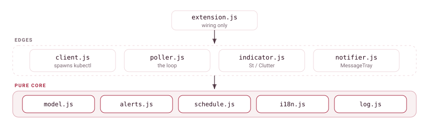
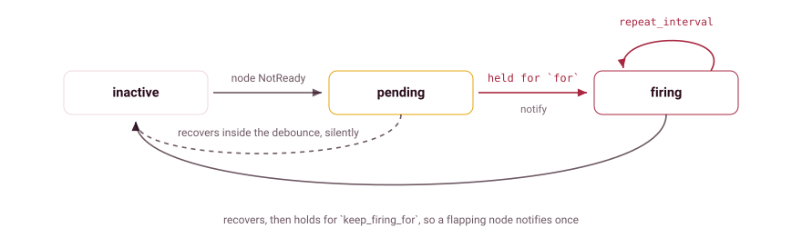
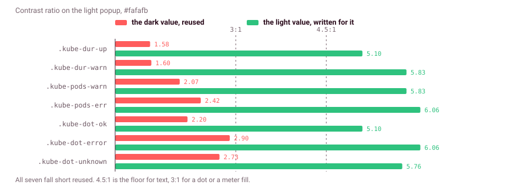

# Architecture

A pure core with thin IO and UI edges. Dependencies point inward toward `model.js`, and nothing imports up. That layering is what makes the logic testable without gnome-shell, and it keeps the shell coupling in three files.

  <picture>
    <source media="(prefers-color-scheme: dark)" srcset="images/brand/layering-dark.svg">
    <source media="(prefers-color-scheme: light)" srcset="images/brand/layering-light.svg">
    
  </picture>

## Modules

| File | Role |
| --- | --- |
| `lib/model.js` | Parsing, severity, sorting, display strings, error classification. Pure. |
| `lib/i18n.js` | `_`, `ngettext`, `pgettext`, `N_`, and `format()`. Pure. |
| `lib/schedule.js` | Poll-cadence math: interval clamp, exponential backoff. Pure. |
| `lib/alerts.js` | The alert state machine. Pure. |
| `lib/log.js` | Opt-in diagnostics behind `debug-logging`. Pure. |
| `lib/theme.js` | Relative luminance, and the light/dark decision it feeds. Pure. |
| `lib/client.js` | The only file that spawns `kubectl`, including the long-lived node watch. |
| `lib/poller.js` | The poll loop and the watch lifecycle: tier selection, backoff, watchdog, reentrancy, coalescing, reconcile. |
| `lib/indicator.js` | The view: `PanelMenu.Button` and its menu. |
| `lib/notifier.js` | The notification edge: a dedicated `MessageTray.Source`. |
| `extension.js` | Wiring only. |

"Pure" means zero `gi://` imports, so the module runs unchanged under gnome-shell, plain gjs and node. Time-dependent functions take an explicit `nowMs` rather than reading a clock.

## Module contracts

**`model.js`** owns `classifyError`, which maps raw kubectl stderr to a `{key, title, detail}`: a short human headline, kubectl's own summary line in preference to the klog noise, and a machine-readable key so callers can branch on the cause instead of matching prose that changes with the locale. Headline wording and its tests live here, not in the view.

**`log.js`** uses `console.log` (GLib `LEVEL_MESSAGE`) rather than `console.debug` (`LEVEL_DEBUG`). GLib's default log writer discards `LEVEL_DEBUG` unless `G_MESSAGES_DEBUG` is set on the process, and you cannot set an environment variable on a gnome-shell the user is already running. Measured in a nested shell, `console.debug` produced nothing at all. Every line goes through `redactForLog` and a length cap.

**`indicator.js`** is decoupled from settings. It emits `refresh-requested`, `context-selected(string)`, `menu-open-changed(bool)`, `node-copied(string)` and `snooze-requested(int seconds)`, and never reads GSettings itself. The first network-shaped poll failure keeps the last data on show under a dim note instead of replacing the menu, since opening the menu forces a re-poll that usually heals it; a second consecutive failure, or any configuration error, renders the full error view. The panel dot is not debounced. Notifications are the extension's job, so the copy row and the mute submenu emit rather than act, and the extension pushes mute state back with `setSnoozeUntil(ms)`.

**`notifier.js`** owns a `MessageTray.Source` titled "Kube Node Monitor" with the helm icon, so banners are attributed to the extension instead of the generic "System" source. It bridges the MessageTray API split at GNOME 46 (45 uses positional constructors and `showNotification`; 46 onward use params objects and `addNotification`) by feature-detecting `addNotification` on the `Source` prototype. The source is recreated after the shell destroys it. At most one alert banner is live at a time (`notifyAlert`): a newer fire replaces it and a resolve withdraws it, so the tray never holds a stale outage banner.

**`extension.js`** feeds each observation through `alerts.reduce`, buffers the returned actions through a `group_wait` timer, dispatches them coalesced to `notifier.js`, and persists the machine's state only when it changes. Its `changed` handler uses a connection-key allowlist (`context`, `kubeconfig-path`, `kubectl-path`) so writing `alert-state` does not self-trigger a re-poll; alert tunables are read live per observation. It also owns the `Gio.NetworkMonitor` handler: poll failures while offline are classified as such, and the first `network-changed` back to available forces an immediate re-poll instead of waiting out the backoff.

## The alert machine

`alerts.js` is a `reduce(prevState, observation, config, nowMs)` reducer turning each poll observation into `fire` and `resolve` actions. It implements a Prometheus rule lifecycle over an Alertmanager-style notify log for dedup and persistence.

  <picture>
    <source media="(prefers-color-scheme: dark)" srcset="images/brand/alert-machine-dark.svg">
    <source media="(prefers-color-scheme: light)" srcset="images/brand/alert-machine-light.svg">
    
  </picture>

Four things sit on top of that lifecycle:

- **Cluster-unreachable inhibition.** While the cluster is unreachable, node records freeze rather than resolving, so an outage does not fabricate a wave of recoveries.
- **Offline inhibition.** An observation flagged `offline` steps like a settle, so a machine with no network never accumulates toward a "cluster unreachable" banner. A pre-existing firing alert survives the gap.
- **A settle guard** for cold start, suspend and long screen locks, which syncs state forward without replaying what happened while nothing was watching.
- **`silencedUntilMs`**, a mute that withholds without marking. An alert still firing when the silence expires is delivered then, not swallowed.

`nowMs` is wall-clock, because the state has to survive a reboot. State is serialized into the `alert-state` GSettings key, and `MAX_TRACKED_ALERTS` caps the persisted map. `groupActions()` coalesces a batch into at most two banners: fires at high urgency, which is deliberately not critical because a critical banner never auto-hides, and resolves at normal.

## Two-tier polling, and the watch that replaces tier 1

Polling cost lands inside the compositor process, so steady state has to be minimal. The poller picks a tier by menu state.

| | Menu closed (almost always) | Menu open |
| --- | --- | --- |
| Call | node watch (poll fallback: `fetchHealth`) | `fetchNodesDetail` + `fetchNodeMetrics` + `fetchPodsSummary` |
| Query | `--watch --output-watch-events` jsonpath | `-o json`, the last two best-effort |
| Payload | one LIST per stream, then deltas only | ~36 KB per node |
| Drives | panel dot and notifications | the full menu |

`setMenuOpen(true)` triggers an immediate detail poll instead of waiting for the next tick.

### Why the watch exists

kubectl's jsonpath is a client-side printer, so the small output hid what a poll actually cost. Measured on a live 4-node k3s cluster, kubectl 1.35, median of six runs:

| | wire, per node | CPU | RSS |
| --- | --- | --- | --- |
| `kubectl version --client`, no API call at all | none | 88 ms | 56 MB |
| jsonpath health poll | 26.5 KB | 183 ms | 61 MB |
| server-printed table (`kubectl get nodes`) | 8.1 KB | 169 ms | 60 MB |

Three things fall out of that.

**The output was never the cost.** jsonpath sends `Accept: application/json` and pulls the full node objects. The ~250 B is only what survives into stdout.

**Most of the cost is not the payload either.** A kubectl that makes no API call still burns 88 ms of CPU and 56 MB of RSS. That is the Go runtime, client-go and TLS setup, paid on every spawn whatever you ask for. Bytes are the smaller half of the bill.

**The cheap representation does not help enough.** The default table is printed server-side (`as=Table`) and moves 3.3x fewer bytes, but costs the same process. Its rows still carry `PartialObjectMetadata` with `managedFields`; `includeObject=None` would be 21x fewer bytes and the CLI cannot pass it.

So the win is not a smaller query. It is not spawning the process 360 times an hour.

### What the watch costs instead

One stream, a full LIST when it opens, then only deltas from the apiserver's watch cache. Measured over 45 s on the same cluster: **170 ms of CPU total, which never rose again**, and 61.8 MB resident and flat. A cordon reached the pipe in 85 ms, with kubectl's duplicate MODIFIED 6 ms behind it, which is what the coalescing window exists for.

| over | polling at the 10 s default | one watch |
| --- | --- | --- |
| 5 minutes | 30 spawns, 5.5 s of CPU | 1 spawn, 0.17 s |
| 1 hour | 360 spawns, 66 s of CPU | 1 spawn, 0.17 s |
| 8 hours | 2880 spawns, 8.8 min of CPU | 1 spawn, 0.17 s |

The byte saving scales with how much metadata the nodes carry, so it is not a universal figure. The same measurement against a 3-node k3d cluster gives 10.3 KB per node and only a 1.5x table ratio, because k3d nodes carry far less annotation bloat than a real one. The process saving does not vary: it is one spawn either way.

### How the watch is wired

Polling never went away: `start()` still polls immediately, and the poll loop keeps running until the watch delivers its first complete snapshot. From then on health polls stand down and any watch trouble brings them straight back, so every failure surface (classification, backoff, offline inhibition) is the poll path unchanged.

- **The stream.** `kubectl get nodes --watch --output-watch-events -o jsonpath=…`, spawned deliberately without `--request-timeout`. Measured: that flag ends a watch cleanly when it elapses, exit code 0, which would look like a healthy server close.
- **Two kubectl 1.35 printer quirks shape the template.** `{range}` does not work on watch events and fails with "not in range, nothing to end", so condition types and statuses arrive as two space-joined lists that `parseWatchEvent` zips back together. And the watch printer pushes output through a tabwriter that pads `\t` into alignment spaces, so fields are separated by `|` instead, which cannot occur in a node name, a condition type or a status.
- **Coalescing.** Events fold into a name-keyed map and flush as one snapshot after 250 ms of quiet, capped at 1.5 s. The initial ADDED burst and kubectl's several-MODIFIED-per-change habit become single deliveries, and the alert machine never observes a half-listed cluster.
- **Heartbeat.** The alert machine steps on observations, so while the stream is silent the current map is re-observed at the poll cadence. No kubectl involved.
- **Respawn.** `classifyWatchExit` reads a stream that lived 60 s as healthy and respawns it at once. Servers close watches after 30 to 60 minutes, and the fresh LIST is the resync.
- **Giving up gracefully.** Short-lived exits back off exponentially. After three, the watch parks behind a 300 s retry and polling carries the load, so a proxy that kills long connections degrades to exactly the old behaviour.
- **Startup watchdog.** A spawn that produces no snapshot within 30 s is killed. A black-holed route can hang a dial far longer than any poll would wait.
- **Reconcile.** Every 300 s a server-printed table (`fetchHealthTable`, the cheap representation above) is compared against the map on membership, readiness and cordon state; drift or two consecutive misses restart the stream. The table cannot see pressure conditions, which is why it only cross-checks the watch and never feeds the dot directly.

The panel dot means the same thing in all three sources because watch, poll and table all derive severity through the same `model.js` helpers.

## Light and dark surfaces

St's CSS subset has no media queries, so a palette cannot follow the theme from `stylesheet.css` alone. `indicator.js` sets one class, `kube-light`, and the light half of the sheet is scoped under it.

The setting is the wrong thing to read. `color-scheme` is `prefer-light` only for GNOME's own Light style, and it says nothing about a user theme or high contrast. Worse, `default` is not "light": libadwaita renders apps light under it while the shell stays dark, which is exactly what makes a half-light desktop look like an extension bug. `styleVariant()` in `theme.js` reads the surface's **foreground** instead and calls dark text a light surface. Foreground rather than background, which a theme may leave transparent.

Two surfaces are probed, not one: the panel button and the menu box. A theme can restyle one and leave the other alone, so a single shared read would put the wrong palette on one of them.

  <picture>
    <source media="(prefers-color-scheme: dark)" srcset="images/brand/contrast-dark.svg">
    <source media="(prefers-color-scheme: light)" srcset="images/brand/contrast-light.svg">
    
  </picture>

| Role | Dark | on `#36363a` | Light | on `#fafafb` | Floor |
| --- | --- | --- | --- | --- | --- |
| `.kube-dur-up` | `#57e389` | 7.31 | `#007c3d` | 5.10 | 4.5 |
| `.kube-dur-warn` | `#f5c211` | 7.22 | `#905400` | 5.83 | 4.5 |
| `.kube-pods-warn` | `#e5a50a` | 5.57 | `#905400` | 5.83 | 4.5 |
| `.kube-pods-err`, `.kube-dur-down`, `.kube-error-title` | `#ff7b72` | 4.77 | `#c30000` | 6.06 | 4.5 |
| `.kube-dot-ok`, `.kube-meter-ok` | `#2ec27e` | 5.23 | `#007c3d` | 5.10 | 3 |
| `.kube-dot-warning`, `.kube-meter-warning` | `#e5a50a` | 5.57 | `#905400` | 5.83 | 3 |
| `.kube-dot-error`, `.kube-meter-error` | `#ff5c5c` | 3.97 | `#c30000` | 6.06 | 3 |
| `.kube-dot`, `.kube-dot-unknown` | `#9a9996` | 4.22 | `#646360` | 5.76 | 3 |
| focus ring | `rgba(120, 145, 255, .85)` | 3.45 | `rgba(4, 97, 190, .85)` | 4.37 | 3 |

4.5:1 is the AA floor for text, 3:1 for a non-text indicator.

The light values are not new hues. They are the dark palette's own, put through libadwaita's standalone rule for light themes, `oklab(from <colour> min(l, 0.5) a b)`, because Adwaita holds nothing green or amber dark enough to carry text on `#fafafb`. Dimmed rows had to be raised too, and that is the half that reads as washed out rather than as the wrong colour: dark text loses more contrast per step of opacity than white text gains, so the same 0.5 that gives 4.31 on the dark popup gives 3.13 on the light one.

Neutral greys are exempt from all of it. `rgba(128, 128, 128, …)` on the hovers, the focus fill and the meter track reads the same either way, which is what makes it the right way to write a hover in the first place.

Timing has two traps. `get_theme_node()` logs a critical for a widget outside the stage, and the panel adopts the button only after `_init` returns, so the first read borrows `Main.panel`'s node. And both `style-changed` handlers are disconnected in `destroy()` before the actors are unparented, because unparenting restyles and the handler would then read a node that has left the stage.

`tests/stylesheet.test.js` fails the build on any hued colour or any `opacity` with no `.kube-light` counterpart, so the two halves cannot drift apart.

## Scale limits

Tier 2 is the expensive one, and it is bounded by the menu being open. Measured on a real 3-node k3s cluster it costs about **36 KB per node**, of which `status.images` is 40%. A 1000-node cluster therefore means roughly 36 MB going through `JSON.parse` on the compositor's main loop while you are looking at the menu.

`MAX_NODE_ROWS` (`indicator.js`) caps rows at 50, sorted most-severe-first with the remainder summarised. The cap was profiled rather than reasoned about, on a Ryzen 7 5800HS under headless GNOME 50, with synthetic nodes tuned to the measured 37 KB.

  <picture>
    <source media="(prefers-color-scheme: dark)" srcset="images/brand/rowcap-dark.svg">
    <source media="(prefers-color-scheme: light)" srcset="images/brand/rowcap-light.svg">
    
  </picture>

| nodes | capped at 50 | uncapped | tier-2 parse |
| --- | --- | --- | --- |
| 50 | 40 ms build / 129 ms laid out | same | 6 ms |
| 200 | 42 / 133 ms | 157 / 641 ms | 24 ms |
| 500 | 39 / 128 ms | 406 / 889 ms | 31 ms |
| 1000 | 43 / 138 ms | 830 / **1826 ms** | 64 ms |

The cap holds cost flat whatever the cluster size. Without it, a 1000-node cluster would freeze the whole shell for nearly two seconds on every menu open. At roughly 2.5 ms per row, halving the cap halves the hitch and shows half the nodes, which is an informed trade rather than a guess. Re-rendering an unchanged list costs about 2.5 ms in total, so the build cost lands on the first open and on a signature change, not on every poll.

The parse column is separate and is **not** capped. It scales with the whole cluster and is the remaining tier-2 cost.

## One optimisation that was measured and rejected

Replacing tier 2's `-o json` with jsonpath does not work. Roles come from label *keys*, jsonpath cannot prefix-filter a map, and emitting `{.metadata.labels}` wholesale is worse: one kubevirt node carried around 500 labels, so the "optimised" query came out only 4x smaller. Doing it properly needs a different projection, custom-columns for the scalars plus the table output's ROLES column. That is a follow-up, not a free win.

---

Locale coverage and what has been verified at runtime: [`translations.md`](translations.md). Conventions a change is expected to follow: [`../AGENTS.md`](../AGENTS.md).
