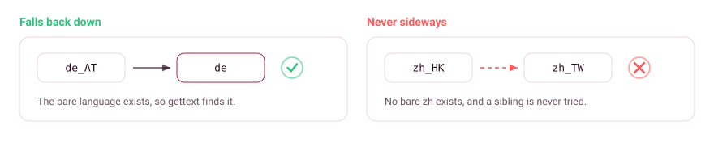

<!--
  Diagrams in images/brand/ are generated by .brand/build.mjs, not hand-edited.
  Each <picture> carries a dark and a light file; GitHub picks one by theme.
-->

# Translations: coverage and verification

Day-to-day rules live in [`../.agents/rules/i18n.md`](../.agents/rules/i18n.md). This file records the two things that took research: which locales actually resolve, and what has been checked at runtime rather than only in tests.

## Why 18 catalogues for 14 languages

gettext falls back from a regional locale to the bare language, but never sideways to a sibling region.

  <picture>
    <source media="(prefers-color-scheme: dark)" srcset="images/brand/fallback-dark.svg">
    <source media="(prefers-color-scheme: light)" srcset="images/brand/fallback-light.svg">
    
  </picture>

`de_AT` finds `de`, `fr_CA` finds `fr`, and likewise `es_MX`, `nl_BE`, `ru_UA`, `ar_MA` and `uk_UA`. But `pt_PT` finds nothing behind `pt_BR`, and `zh_TW`, `zh_HK` and `zh_SG` each find nothing behind `zh_CN`, so a Hong Kong desktop lands on English rather than on `zh_TW`. Measured across 30 locales, not assumed.

So Portuguese and Chinese need a catalogue per region:

- `zh_HK` is `zh_TW` adapted for Hong Kong (連接 for a connection, not Taiwan's 連線).
- `zh_SG` is `zh_CN` unchanged, since Singapore follows mainland simplification.

Both are labelled as derivations in the file that generates them rather than presented as independent work.

## RTL is a stylesheet problem, not a translation one

St's CSS subset has no logical properties: gnome-shell's own theme uses the `:ltr` and `:rtl` pseudo-classes in 28 places and `margin-inline-*` in none. Meanwhile `StBoxLayout` *does* reverse its children under RTL, so a bare `margin-left` keeps pushing right in Arabic while the neighbour it was clearing has moved.

Three rules had exactly that bug: `.kube-caret`, `.kube-context-icon` and `.kube-node-meters`. They are now split per direction, and `tests/stylesheet.test.js` fails the build if a directional property appears outside an `:ltr`/`:rtl` selector, or if one side is declared without the other.

## What has been verified at runtime

- **Both gi-free modules rendering through the real shell.** A headless GNOME 50 with an isolated dconf store and a deliberately broken `kubectl-path` logged `poll: failed … reason=У kubectl виникла помилка` and `alert: posting banner title=kubectl ist auf ein Problem gestoßen`. Set `XDG_CONFIG_HOME` **before** `dbus-run-session`, so the activated dconf service inherits it. Setting it inside the script leaks writes to the real store.
- **Plural selection against the compiled `.mo`**, driving the pure modules under standalone `gjs`: uk exercises all three forms, ar all six.
- **The preferences window built end-to-end in a real Adw process** for uk, de, ar and ja.
- **GNOME 45 compatibility.** `ExtensionBase` was checked against upstream and carries the same three instance methods and the same `initTranslations`, so the binding works across 45 to 50.
- **A real RTL locale.** `ar_EG` built with `localedef` into a `LOCPATH`, since the machine has none. GTK reports `TextDirection.RTL`, and the extension still reaches the shell and logs Arabic with the direction-split stylesheet in place.

## What is not verified

- **The pixels of an RTL layout.** GNOME 50's mutter dropped `--x11`, so no window manager is available under Xvfb to place a mirrored window on screen, and the shell refuses screenshots outside unsafe mode. That gap is toolkit behaviour rather than ours.
- **Native review.** English is the source text and is written by hand, as are `ru` and `uk`, which the maintainer reads. The other sixteen carry a header comment saying they are AI-generated. A pass per language has since checked each against its GNOME team's conventions, which caught calques, register slips and two error headlines that had drifted from the msgid: an unverifiable certificate is not an invalid one, and an expired login is a fact rather than an instruction. That is review, not sign-off. Corrections are welcome and the `Last-Translator` field is yours to claim.

---

Module layering and the measurements behind the row cap: [`architecture.md`](architecture.md). Conventions a change is expected to follow: [`../AGENTS.md`](../AGENTS.md).
